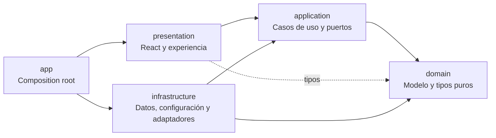
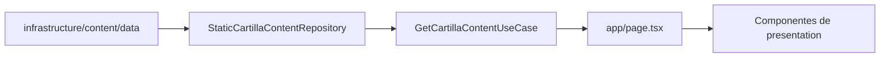
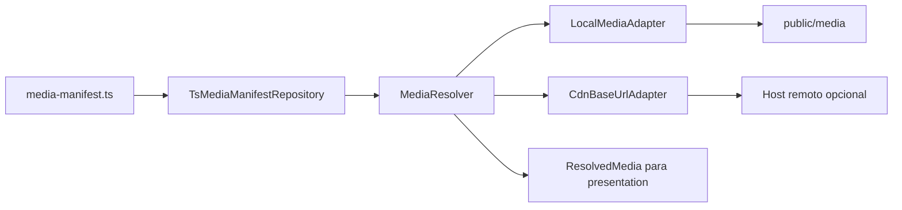
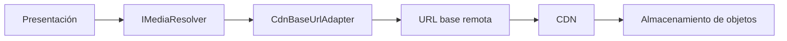

# Cartilla Web GenAI · UAO

Experiencia multimedia interactiva para la apropiación del **modelo de proceso de inteligencia artificial generativa en la formación docente de la Universidad Autónoma de Occidente**.

La aplicación presenta un recorrido de seis etapas para acompañar a docentes de la UAO en la integración crítica, creativa, ética y pedagógicamente responsable de herramientas de inteligencia artificial generativa en sus prácticas de enseñanza.

> **Demostración:** https://modelo-proceso-repo.vercel.app/

---

## Contenido

- [Propósito](#propósito)
- [Público y alcance](#público-y-alcance)
- [Experiencia y funcionalidades](#experiencia-y-funcionalidades)
- [Las seis etapas](#las-seis-etapas)
- [Arquitectura](#arquitectura)
- [Estructura del repositorio](#estructura-del-repositorio)
- [Tecnologías](#tecnologías)
- [Instalación y ejecución](#instalación-y-ejecución)
- [Contenido pedagógico](#contenido-pedagógico)
- [Gestión multimedia](#gestión-multimedia)
- [Integración del autodiagnóstico](#integración-del-autodiagnóstico)
- [Reflexiones locales](#reflexiones-locales)
- [Calidad y pruebas](#calidad-y-pruebas)
- [Despliegue](#despliegue)
- [Evolución futura](#evolución-futura)
- [Límites del sistema](#límites-del-sistema)
- [Autores y contexto académico](#autores-y-contexto-académico)
- [Licencia](#licencia)

---

## Propósito

La cartilla busca facilitar la comprensión y apropiación de un modelo de proceso para integrar GenAI en la docencia. No funciona como plataforma de gestión académica ni reemplaza el criterio profesional del docente: organiza contenidos, preguntas, medios y herramientas que apoyan la toma de decisiones.

Sus objetivos de experiencia son:

- presentar el modelo de forma comprensible y navegable;
- permitir un recorrido lineal o libre entre sus etapas;
- ofrecer orientaciones para distintos estados de apropiación;
- integrar recursos multimedia y plantillas descargables;
- promover decisiones pedagógicas, éticas y críticas;
- facilitar reflexiones personales sin convertirlas en evaluación.

## Público y alcance

**Público principal:** docentes de la Universidad Autónoma de Occidente.

**Contexto de uso:** consulta individual desde navegador web, principalmente en computador de escritorio.

**Alcance funcional:**

- introducción institucional y narrativa;
- navegación por un modelo en espiral;
- acompañamiento de LaIA;
- autodiagnóstico externo integrado en la Etapa 1;
- seis capítulos o etapas;
- imágenes, infografías, modelos 3D, videos y tarjetas;
- vistas previas y descarga de recursos PDF;
- reflexiones almacenadas localmente;
- cinco factores rectores al cierre del recorrido.

## Experiencia y funcionalidades

### Navegación

La aplicación es una experiencia de **una sola página con desplazamiento vertical**.

Existen dos representaciones tridimensionales con funciones diferentes:

- El **modelo 3D introductorio** es exploratorio y puede arrastrarse.
- La **espiral de navegación** no se arrastra: sus etapas se seleccionan para dirigirse al capítulo correspondiente.

La navegación también ofrece:

- lista textual alternativa con las seis etapas;
- acceso al capítulo siguiente;
- botón fijo para volver al mapa;
- navegación mediante anclas `#etapa-N`;
- alternativa accesible al `canvas` WebGL.

### LaIA

LaIA es la guía narrativa de la cartilla. Sus mensajes:

- presentan la experiencia;
- orientan el inicio de las etapas;
- se recorren mediante controles `Leer más` y `Anterior`;
- acompañan cierres y preguntas de reflexión;
- no conversan con el usuario ni toman decisiones en su nombre.

### Recursos

La experiencia incluye:

- textos segmentados;
- imágenes e infografías;
- animaciones y videos de transición;
- videos de cierre controlados manualmente;
- tarjetas y apartados desplegables;
- carrusel de evidencias en la Etapa 5;
- recursos descargables con descripción y vista previa.

## Las seis etapas

| Etapa | Nombre | Intención |
|---:|---|---|
| 1 | **Reconócete para avanzar** | Identificar el punto de partida y comprender el propósito del proceso. |
| 2 | **Descubre nuevas posibilidades** | Explorar herramientas y posibilidades con criterios pedagógicos, críticos y éticos. |
| 3 | **Diseña con propósito** | Concebir una experiencia de aprendizaje mediada por GenAI. |
| 4 | **Prepara el terreno para el éxito** | Revisar condiciones pedagógicas, técnicas y éticas antes de la implementación. |
| 5 | **Hazlo realidad en el aula** | Acompañar la experiencia y reconocer evidencias y momentos críticos. |
| 6 | **Reflexiona, aprende y mejora** | Evaluar lo ocurrido y proyectar una nueva iteración del modelo. |

El cierre presenta cinco factores rectores: **propósito, razonamiento crítico, ética, herramientas y reflexión**.


## Arquitectura

El proyecto utiliza **Clean Architecture dentro de un monolito modular**. La separación principal mantiene el dominio y los casos de uso independientes de Next.js, React y proveedores concretos.



### Responsabilidades

| Capa | Responsabilidad |
|---|---|
| `domain` | Entidades, value objects y contratos puros del modelo. |
| `application` | Casos de uso y puertos requeridos por la aplicación. |
| `infrastructure` | Repositorios estáticos, contenido, manifiesto multimedia, adaptadores, configuración e integración externa. |
| `presentation` | Componentes React, hooks, providers, navegación y elementos de interfaz. |
| `app` | Composition root de Next.js: construye casos de uso, resuelve medios y conecta la presentación. |

Las decisiones principales están registradas en:

```text
docs/adr/0001-clean-architecture-y-convencion-multimedia.md
```

### Flujo del contenido



El contenido pedagógico permanece fuera de los componentes JSX. `StageChapter` reutiliza la misma estructura para las seis etapas.

## Estructura del repositorio

```text
.
├── docs/
│   └── adr/
├── e2e/
├── public/
│   └── media/
├── scripts/
├── src/
│   ├── app/
│   ├── application/
│   │   ├── content/
│   │   └── media/
│   ├── domain/
│   │   ├── content/
│   │   └── media/
│   ├── infrastructure/
│   │   ├── config/
│   │   ├── content/
│   │   │   └── data/
│   │   ├── media/
│   │   │   ├── manifest/
│   │   │   └── providers/
│   │   └── n8n/
│   ├── presentation/
│   │   ├── content/
│   │   ├── hooks/
│   │   ├── laia/
│   │   ├── reflection/
│   │   ├── sections/
│   │   ├── shell/
│   │   ├── spiral/
│   │   ├── stage/
│   │   └── video/
│   └── styles/
├── next.config.ts
├── package.json
├── playwright.config.ts
└── tsconfig.json
```

No deben crearse raíces paralelas como `src/components`, `src/content`, `src/context` o `src/lib`, porque romperían la convención arquitectónica auditada por el proyecto.

## Tecnologías

- **Next.js 16** con App Router.
- **React 19**.
- **TypeScript** en modo estricto.
- **Three.js**, React Three Fiber y Drei para los recursos 3D.
- **GSAP** para revelado y desplazamiento.
- **CSS Modules** y tokens visuales institucionales.
- **Lucide React** para iconografía.
- **pnpm** como gestor de paquetes.
- **Playwright** y `axe-core` para comprobaciones end-to-end y de accesibilidad en flujos críticos.


## Instalación y ejecución

### Requisitos

- Node.js compatible con Next.js 16.
- `pnpm`.
- Acceso a Internet durante la instalación.
- Acceso a Google Fonts durante el `build`, mientras la tipografía DM Sans se cargue mediante `next/font/google`.

### Desarrollo local

```bash
pnpm install
pnpm dev
```

La aplicación estará disponible en:

```text
http://localhost:3000
```

### Compilación y ejecución de producción

```bash
pnpm build
pnpm start
```

## Contenido pedagógico

Los datos de la cartilla se encuentran en:

```text
src/infrastructure/content/data/
```

Allí se organizan:

- portada e introducción;
- mensajes de LaIA;
- seis etapas;
- factores rectores;
- cierre final.

Para modificar contenido:

1. Edita el archivo de datos correspondiente.
2. Conserva los tipos definidos en `src/domain/content`.
3. Evita escribir contenido pedagógico directamente en JSX.
4. Registra los medios nuevos en el manifiesto.
5. Ejecuta las puertas de calidad.

Agregar o modificar una etapa no requiere crear una página nueva: el repositorio estático entrega los datos y `StageChapter` los representa mediante el mismo motor de presentación.


## Gestión multimedia

### Estado actual

Los recursos publicados viven principalmente en:

```text
public/media/
├── compartido/
│   ├── imagenes/
│   └── modelos/
├── introduccion/
│   └── videos/
└── etapa-N/
    ├── imagenes/
    ├── videos/
    └── descargables/
```

Convenciones:

- nombres en minúsculas;
- `kebab-case`;
- sin espacios;
- una categoría solo existe cuando contiene archivos;
- cada recurso utilizado por el contenido se registra una sola vez.

La fuente central de rutas y proveedores es:

```text
src/infrastructure/media/manifest/media-manifest.ts
```

### Resolución de medios



Componentes principales:

- `IMediaResolver`: puerto usado para solicitar medios.
- `IMediaManifestRepository`: puerto del repositorio de manifiesto.
- `TsMediaManifestRepository`: implementación TypeScript del manifiesto.
- `MediaResolver`: busca el recurso y selecciona el adaptador compatible.
- `LocalMediaAdapter`: devuelve rutas servidas desde `public`.
- `CdnBaseUrlAdapter`: construye URLs a partir de una URL base remota configurada para el proveedor multimedia.
- `MediaProviderAdapter`: contrato común de los proveedores.
- `getMediaResolver()`: composition root y singleton del resolver.

Los componentes de presentación reciben un `ResolvedMedia`; no necesitan conocer si el archivo es local o remoto.

Los recursos con `availability: "pending"` producen un fallback controlado y no deben considerarse publicados.

## Integración del autodiagnóstico

El autodiagnóstico se presenta dentro de la Etapa 1 como una integración externa. Su configuración se centraliza en:

```text
src/infrastructure/n8n/n8n.config.ts
```

La cartilla:

- explica su propósito antes de abrirlo;
- presenta las condiciones de tratamiento de datos;
- exige autorización voluntaria;
- carga el formulario dentro de un diálogo o contenedor;
- permite regresar al recorrido.

El sistema externo:

- es propiedad de otro proyecto;
- administra su propio formulario;
- define sus preguntas, procesamiento y resultados;
- no forma parte de la lógica interna de esta cartilla.

La validación del proyecto cubre la explicación, el consentimiento, la carga y la interacción básica con el componente embebido. No cubre la exactitud de sus cálculos ni la presentación de sus resultados.

### Configuración de seguridad

`next.config.ts` define cabeceras de seguridad y una Content Security Policy que restringe:

- imágenes;
- videos;
- conexiones;
- contenido embebido;
- permisos de cámara, micrófono y geolocalización.

Cuando cambie el host del formulario o de los medios remotos, también deben actualizarse de forma controlada las fuentes permitidas por la CSP.

## Reflexiones locales

Cada etapa puede incluir una pausa reflexiva.

Las respuestas:

- son personales;
- son voluntarias;
- son locales;
- no son evaluativas;
- no se envían a un servidor;
- no reciben puntuación ni interpretación automática.

El componente utiliza `localStorage` con una clave por etapa:

```text
reflection_stage_<numero>
```

Por esta razón:

- la respuesta permanece en el mismo navegador;
- puede desaparecer si el usuario limpia los datos del sitio;
- no se sincroniza entre dispositivos;
- no debe utilizarse para guardar información sensible.


## Calidad y pruebas

### Puertas de calidad

```bash
pnpm lint
pnpm typecheck
pnpm audit:architecture
pnpm build
```

La auditoría arquitectónica comprueba:

- archivos TypeScript/TSX alcanzables desde App Router;
- dependencias permitidas entre capas;
- raíces inesperadas bajo `src`;
- archivos de `public` sin referencia;
- claves del manifiesto sin consumidor.

### Pruebas end-to-end disponibles

```bash
pnpm build
pnpm test:e2e
```

La configuración de Playwright contempla proyectos de escritorio, tableta y móvil. Las pruebas existentes cubren flujos críticos como:

- consentimiento y apertura del autodiagnóstico;
- accesibilidad de la tarjeta de consentimiento;
- adaptación sin desbordamiento;
- presencia, vista previa y descarga de recursos;
- redirección de rutas multimedia heredadas;
- foco en diálogos;
- comprobaciones con `axe-core`.

Las pruebas de aceptación con docentes y los resultados del plan S10 se documentan por separado del código automatizado.

## Despliegue

El proyecto puede desplegarse en una plataforma compatible con Next.js, como Vercel.

Antes de desplegar:

1. Verifica la configuración del autodiagnóstico y de los proveedores externos.
2. Ejecuta lint, typecheck, auditoría y build.
3. Comprueba la CSP y los hosts externos.
4. Verifica imágenes, videos, modelos, vistas previas y PDF.
5. Confirma el acceso al autodiagnóstico desde el entorno desplegado.
6. Comprueba la navegación de escritorio y la alternativa textual al `canvas`.

El despliegue actual se encuentra en:

```text
https://modelo-proceso-repo.vercel.app/
```

## Evolución futura

### Repositorio multimedia remoto

La arquitectura está preparada para combinar medios locales y remotos sin reestructurar la experiencia.

Una evolución futura podría utilizar:

- Amazon S3 con CloudFront;
- Cloudflare R2;
- Azure Blob Storage;
- otro almacenamiento que entregue archivos mediante HTTPS y una URL base estable.

No hay un proveedor remoto obligatorio ni una migración activa.



Procedimiento futuro:

1. Crear el almacenamiento remoto.
2. Subir los archivos conservando sus rutas relativas.
3. Configurar una CDN o dominio.
4. Configurar la URL base remota en el mecanismo de despliegue previsto para el proveedor multimedia.
5. Cambiar en el manifiesto únicamente los recursos deseados de `local` a `http`.
6. Permitir el host en la CSP y, cuando corresponda, en la configuración de imágenes.
7. Validar tipos MIME, CORS, caché, solicitudes de rango y descargas.
8. Migrar primero videos, modelos y PDF pesados.
9. Conservar logos, iconos y recursos pequeños localmente cuando sea conveniente.

La migración puede ser progresiva porque el manifiesto admite proveedores diferentes por recurso.

### Repositorio de contenido intercambiable

`TsMediaManifestRepository` y `StaticCartillaContentRepository` están detrás de puertos. En una evolución posterior podrían reemplazarse por JSON, API, CMS o repositorios remotos, siempre que se conserven los contratos de la capa de aplicación.

Esta posibilidad no está implementada actualmente y no constituye un requisito del producto.

## Límites del sistema

La cartilla no:

- autentica usuarios;
- crea cuentas;
- funciona como LMS;
- califica al docente;
- interpreta automáticamente sus reflexiones;
- almacena reflexiones en servidor;
- controla la lógica interna del autodiagnóstico externo;
- requiere actualmente un CDN o almacenamiento remoto;
- reemplaza el criterio pedagógico, ético o institucional.

## Autores y contexto académico

Proyecto desarrollado en la **Universidad Autónoma de Occidente** como parte de un trabajo de grado sobre la apropiación del modelo de proceso de inteligencia artificial generativa en la formación docente.

**Autores del repositorio:**

- Nicolás Cortés
- Juan David Carvajal

## Licencia

Este repositorio no incluye actualmente un archivo `LICENSE`.

Antes de reutilizar, distribuir o modificar el contenido, el código, la identidad visual, los recursos pedagógicos o los archivos multimedia fuera de su contexto académico, debe consultarse a los autores y a la Universidad Autónoma de Occidente.
