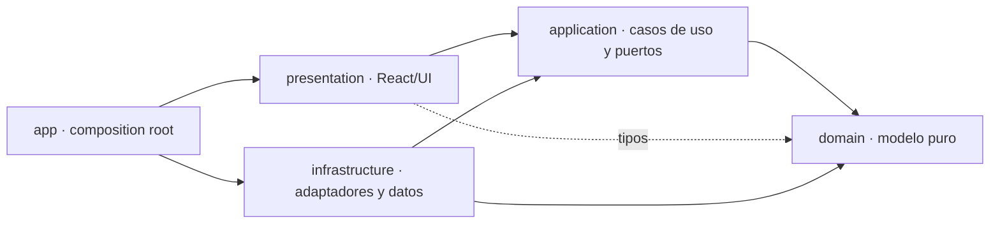

# ADR-0001: Clean Architecture y convención multimedia

## Estado

Aceptada el 24 de julio de 2026.

## Contexto

La aplicación es una cartilla de una sola página construida con Next.js App
Router. La implementación ya separaba parte del dominio y la infraestructura,
pero coexistían raíces paralelas (`components`, `content`, `context`, `lib`),
metadatos duplicados de las etapas y varias convenciones incompatibles dentro
de `public/`. La documentación describía además una versión anterior del
producto.

La restricción principal de esta decisión es conservar sin cambios la
funcionalidad, el contenido, las interacciones y el aspecto visual de la
página.

## Decisión

Mantener un monolito modular con Clean Architecture:

Reglas:

1. `domain` no importa ninguna capa externa.
2. `application` solo depende de `domain`.
3. `infrastructure` implementa puertos de `application` y construye entidades
   de `domain`.
4. `presentation` concentra componentes, providers y hooks React; no importa
   adaptadores concretos.
5. `app` es el composition root que conecta infraestructura y presentación.
6. Los datos estáticos de la cartilla viven junto al repositorio que los
   adapta, en `infrastructure/content/data`.
7. El manifiesto de medios es la única fuente de rutas de imágenes, videos y
   descargables consumidos por el contenido.
8. Los assets se nombran en minúsculas y kebab-case. Los específicos de una
   etapa viven en `public/media/etapa-N/{imagenes,videos,descargables}`; los
   compartidos viven en `public/media/compartido`.
9. pnpm es el único gestor de paquetes.
10. `scripts/audit-architecture.mjs` valida alcance, límites de capas, raíces
    inesperadas, assets sin referencia y claves multimedia sin consumidor.

## Requisitos no funcionales

- Mantenibilidad: una sola ubicación por responsabilidad y cero fuentes
  duplicadas de metadatos.
- Fiabilidad: los recursos publicados deben corresponder uno a uno con una
  referencia del código.
- Rendimiento: no se despliegan masters, copias de trabajo ni precargas de
  integraciones ausentes.
- Seguridad: CSP limitada a los hosts realmente utilizados; N8N permanece como
  única integración externa activa.
- Accesibilidad: la reestructuración no modifica semántica, foco, controles,
  preferencia de movimiento reducido ni navegación alternativa al canvas.
- Operación: lint, typecheck, build y auditoría arquitectónica son las puertas
  de calidad.

## Consecuencias

### Positivas

- El grafo completo de producción queda alcanzable desde los entrypoints.
- Desaparecen las dependencias entre capas no permitidas.
- Agregar una etapa o un medio tiene una ubicación y una convención únicas.
- Los cambios de proveedor multimedia siguen encapsulados tras `IMediaResolver`.
- La auditoría puede repetirse con un comando local.

### Negativas

- El historial de Git mostrará muchos renombres de assets binarios.
- Los enlaces externos que apuntaran a rutas internas no documentadas pueden
  requerir redirects adicionales.
- DM Sans continúa dependiendo de `next/font/google` durante el build; no se
  localizó la fuente para evitar cualquier cambio visual.

### Neutrales

- No se introducen microservicios, contenedores de inyección ni un framework de
  estado adicional.
- La espiral GLB sigue siendo un recurso directo de presentación porque no forma
  parte del contenido pedagógico intercambiable.

## Alternativas consideradas

### Organización por feature

Agrupar cada etapa con sus componentes y datos reduciría distancias de imports,
pero duplicaría el motor de presentación y debilitaría los límites ya
establecidos. Se descarta.

### Mantener raíces paralelas

Conservar `components`, `content`, `context` y `lib` evitaría renombres, pero
mantendría ambigua la propiedad de cada pieza. Se descarta.

### Migrar todo el contenido a un CMS

Facilitaría edición remota, pero agrega operación, autenticación y fallos de red
sin una necesidad actual. Se pospone hasta que exista ese requisito.

### Microservicios

No aportan valor a una cartilla estática y elevarían de forma desproporcionada
la complejidad operativa. Se descartan.

## Riesgos y mitigaciones

- Rutas multimedia rotas: el auditor compara todos los archivos de `public`
  con las referencias y el build/typecheck valida el manifiesto.
- Regresiones visuales: los binarios se mueven sin recomprimir y los componentes
  conservan sus props y estilos.
- Nuevos huérfanos: ejecutar `pnpm audit:architecture` antes de integrar cambios.
- Dependencia de Google Fonts en CI sin red: permitir salida a
  `fonts.googleapis.com`/`fonts.gstatic.com` o, mediante una decisión separada,
  versionar los mismos archivos de DM Sans localmente.
